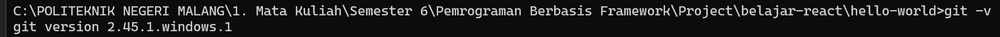
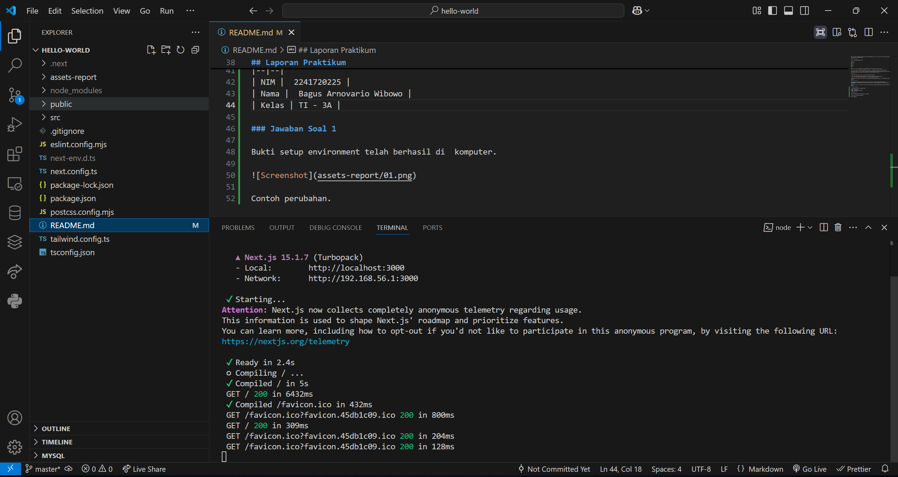

# Laporan Praktikum 

|       | Pemrograman Berbasis Framework 2025 |
| ----- | ----------------------------------- |
| NIM   | 2241720225                          |
| Nama  | Bagus Arnovario Wibowo              |
| Kelas | TI - 3A                             |

## Praktikum 1 : Menyiapkan Lingkungan Pengembangan

### Jawaban Pertanyaan Praktikum 1

Git digunakan untuk mengelola versi kode, publish, cloning atau kolaborasi project ke dalam repositori yang telah dibuat pada github.
VS Code digunakan sebagai code editor untuk mengerjakan project pada praktikum kali ini.
Node.js digunakan sebagai penyedia runtime untuk menjalankan Next.js serta mengelola dependensi melalui npm atau yarn.

## Praktikum 2 : 

### Jawaban Pertanyaan Praktikum 2

## Praktikum 3 : 

### Jawaban Pertanyaan Praktikum 3

## Praktikum 4 : 

### Jawaban Pertanyaan Praktikum 4