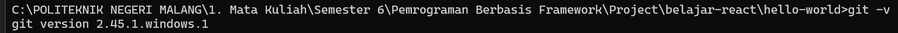
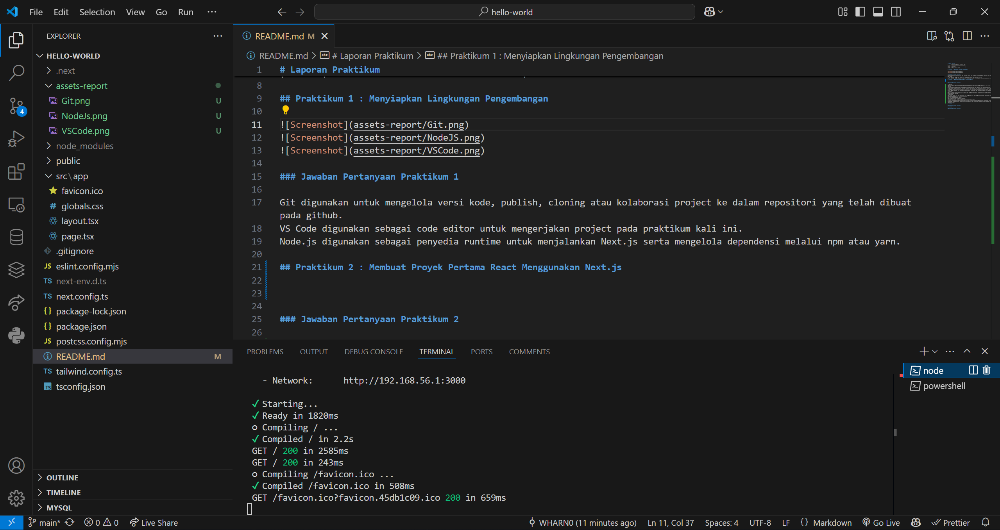
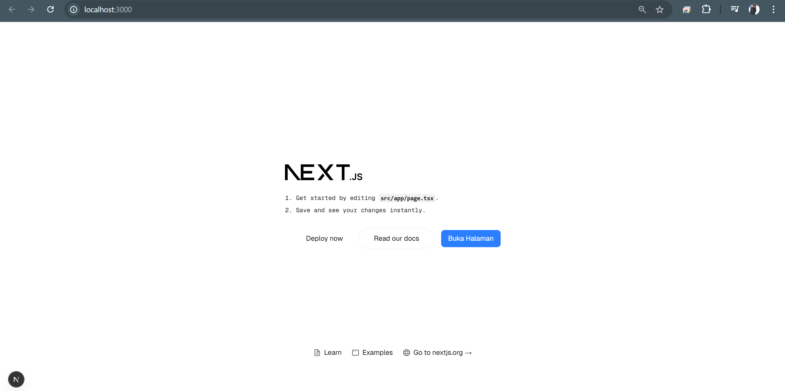
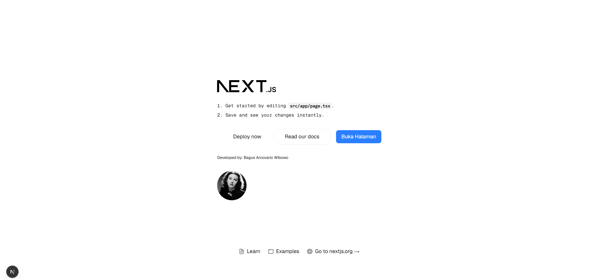

# Laporan Praktikum

|       | Pemrograman Berbasis Framework 2025 |
| ----- | ----------------------------------- |
| NIM   | 2241720225                          |
| Nama  | Bagus Arnovario Wibowo              |
| Kelas | TI - 3A                             |

## Praktikum 1 : Menyiapkan Lingkungan Pengembangan

.png)
.png)

### Jawaban Pertanyaan Praktikum 1

- Git digunakan untuk mengelola versi kode, publish, cloning atau kolaborasi project ke dalam repositori yang telah dibuat pada github.
- VS Code digunakan sebagai code editor untuk mengerjakan project pada praktikum kali ini.
- Node.js digunakan sebagai penyedia runtime untuk menjalankan Next.js serta mengelola dependensi melalui npm atau yarn.

## Praktikum 2 : Membuat Proyek Pertama React Menggunakan Next.js

.png>)

### Jawaban Pertanyaan Praktikum 2

- TypeScript
  TypeScript adalah superset dari JavaScript yang menambahkan tipe data statis. Dengan TypeScript, kode menjadi lebih aman dan mudah dipahami karena adanya pengecekan tipe saat pengembangan, yang membantu mengurangi error.
- ESLint
  ESLint adalah alat yang digunakan untuk menganalisis kode JavaScript atau TypeScript guna memastikan kualitas kode tetap terjaga. ESLint membantu mendeteksi kesalahan sintaksis, gaya penulisan yang tidak konsisten, serta potensi bug dalam kode.
- Tailwind CSS
  Tailwind CSS adalah framework CSS berbasis utility-first yang memungkinkan pengembangan antarmuka dengan lebih cepat dan efisien. Dengan Tailwind, kita dapat menulis gaya langsung dalam elemen HTML tanpa perlu membuat file CSS terpisah.
- App Router
  App Router adalah sistem routing baru di Next.js yang menggunakan pendekatan berbasis direktori (app/). Dengan sistem ini, Next.js dapat mengelola halaman secara lebih efisien, mendukung fitur server components, serta memungkinkan penggunaan layout yang lebih fleksibel.
- Import Alias
  Import alias adalah fitur yang memungkinkan kita menggunakan jalur impor yang lebih pendek dan mudah dibaca dalam proyek. Contohnya, daripada menulis:
  import Component from '../../components/Component'
  Kita bisa menggunakan alias seperti:
  import Component from '@/components/Component'
  Alias ini diatur dalam konfigurasi proyek (misalnya di tsconfig.json).
- Turbopack
  Turbopack adalah bundler modern yang digunakan oleh Next.js sebagai pengganti Webpack untuk meningkatkan kecepatan dalam pengembangan. Turbopack dibuat dengan Rust dan diklaim lebih cepat dibandingkan Webpack, terutama dalam hot module replacement (HMR).

- Folder :

  - .next
    Folder ini dihasilkan secara otomatis oleh Next.js setelah proyek dijalankan.
    Berisi file hasil build, cache, dan data untuk meningkatkan performa aplikasi.
    Folder ini tidak perlu dimodifikasi secara manual.
  - node_modules
    Berisi semua dependensi (package) yang diinstal menggunakan npm install atau yarn install.
    Folder ini dibuat berdasarkan daftar dependensi di package.json.
  - public
    Folder ini digunakan untuk menyimpan aset statis seperti gambar, ikon, dan file lainnya yang dapat diakses langsung melalui URL (misalnya, /favicon.ico).
  - src
    Merupakan folder utama untuk mengembangkan aplikasi menggunakan sistem App Router di Next.js.
    Di dalamnya terdapat file-file utama seperti layout.tsx, page.tsx, dan globals.css.

- File :
  - .gitignore
    File ini berisi daftar file dan folder yang harus diabaikan oleh Git (misalnya node_modules, .next).
  - eslint.config.mjs
    Konfigurasi untuk ESLint yang berfungsi sebagai linter untuk memastikan kode tetap bersih dan sesuai standar.
  - next-env.d.ts
    File deklarasi TypeScript yang dibuat secara otomatis oleh Next.js.
    Berfungsi untuk memberikan dukungan TypeScript di proyek Next.js.
  - next.config.ts
    Konfigurasi untuk Next.js, di mana kita bisa mengatur opsi seperti redirect, image optimization, dan lain-lain.
  - package-lock.json
    File ini dibuat secara otomatis oleh npm untuk mencatat versi pasti dari dependensi yang diinstal.
    Berguna untuk menjaga konsistensi versi di berbagai lingkungan.
  - package.json
    Berisi daftar dependensi dan skrip untuk menjalankan proyek.
    File ini menentukan konfigurasi dasar aplikasi, seperti nama, versi, dan skrip start, build, dll.
  - postcss.config.mjs
    Konfigurasi untuk PostCSS, yang biasanya digunakan bersama Tailwind CSS untuk memproses CSS.
  - README.md
    File dokumentasi proyek yang biasanya berisi informasi tentang cara menjalankan dan menggunakan aplikasi.
  - tailwind.config.ts
    Konfigurasi untuk Tailwind CSS, tempat kita bisa menyesuaikan tema, breakpoints, dan utility classes tambahan.
  - tsconfig.json
    Konfigurasi untuk TypeScript yang menentukan aturan pengecekan tipe dan pengaturan transpiler.

## Praktikum 3 : Menambahkan Komponen React (Button)

## Praktikum 4 : Menulis Markup dengan JSX

### Jawaban Pertanyaan Praktikum 4

- Sintaks user.imageUrl digunakan untuk mengambil nilai properti imageUrl dari objek user. Dalam kode ini, user.imageUrl digunakan sebagai sumber gambar (src) pada elemen , sehingga gambar yang ditampilkan berasal dari URL yang tersimpan di dalam objek user.
